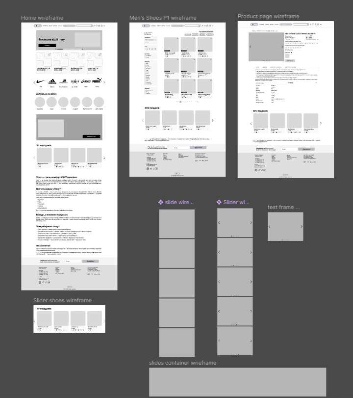
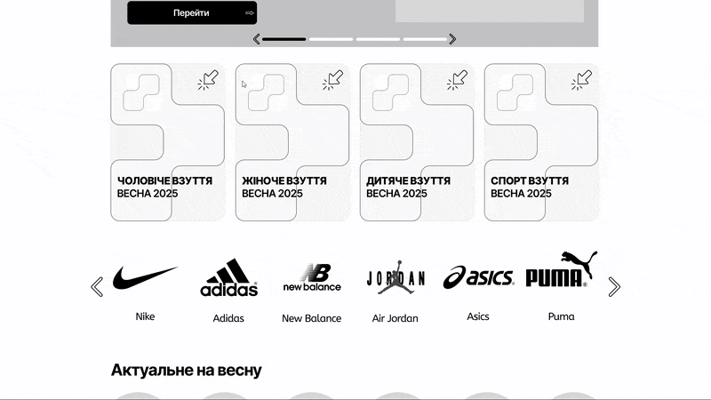
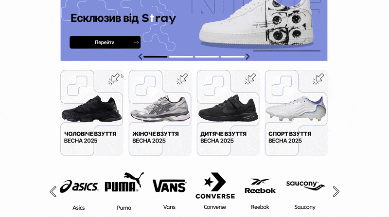
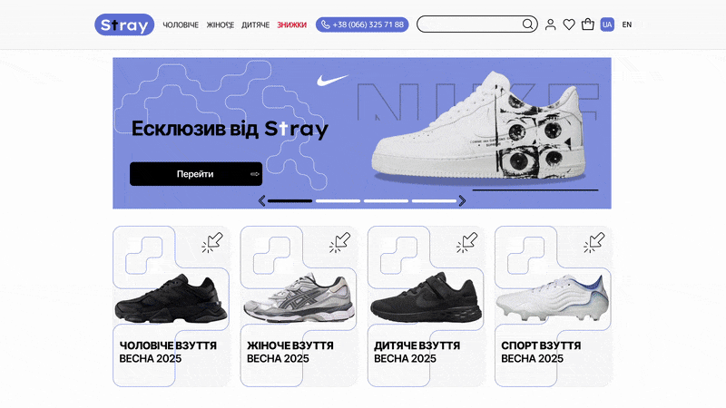
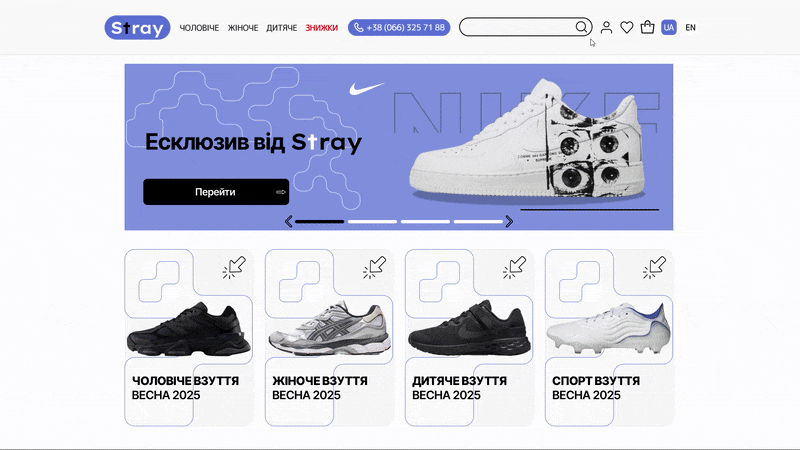
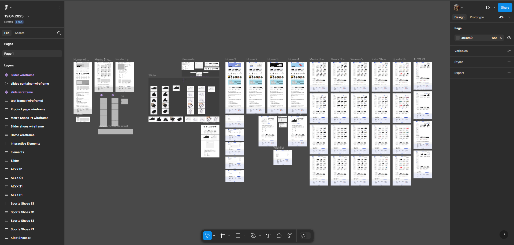

# ПЗ-12: Розробка wireframe (прототип)

## Мета роботи  
Опанувати створення деталізованого вайрфрейму сайту для інтернет-магазину у Figma та перехід до створення мокапу (макету) після завершення вайрфрейму. Цим я ускладнив собі задачу, оскільки замість простої роботи з вайрфреймом, я додав етап створення мокапу, який включає візуальне оформлення сайту з деталями дизайну, кольоровими схемами та стилістичними елементами. Це дозволило створити більш реалістичний прототип, що демонструє функціональність і дизайн інтерфейсу.

## Завдання  
- Створити **деталізований wireframe** сайту інтернет-магазину (головна сторінка та 2–3 сторінки товару) у Figma.  
- Тематику обрати самостійно. У моєму випадку — **магазин взуття**.  
- Розробка здійснювалась у **desktop-розмірі екрана**.  
- Замість базового wireframe було створено **високоточний макет**, максимально наближений до фінального вигляду сайту.  
- Застосовано функції **прототипування** у Figma для реалізації клікабельного прототипу.  
- Для демонстрації інтерактивності створено серію анімацій.

## Використані інструменти  
- **Figma**  
- Прототипування (Prototype mode)  
- Компоненти, Auto layout, Overlays, Scrolls  
- Анімація переходів між екранами

## Демонстрація вайрфрейму  
**Тест інтерактивності базового прототипу (wireframe)** — демонстрація первинного клікабельного прототипу перед переходом до розробки макету  

  

  

## GIF-обмежений показ інтерактивності сторінок та компонентів

1. **Інтерактивні елементи** — демонстрація усіх клікабельних компонентів: скрол, дропдауни, слайдери тощо  
   

     
   

2. **Головна сторінка** — показ функціональності інтерактивних елементів на домашній сторінці  
   

     
   

3. **Каталог (чоловіче взуття)** — дві сторінки товарів. Показ роботи сортування: за ціною (від дешевих), за популярністю, та по знижкам (від найбільших)  
   

     
   

4. **Каталог (жіноче взуття)** — аналогічна демонстрація функціоналу сортування для категорії жіночого взуття  
   

     
   

5. **Каталог (дитяче взуття)** — відображення товарів зі знижками для дитячої категорії  
   

     
   

6. **Картка товару** — показ інтерактивності кнопок, наведення (оверлеї), вибір розміру, додавання до кошика  
   

     
   

7. **Каталог (спортивне взуття)** — відображення взуття спортивного стилю та фільтр за брендом ALYX  
   

     
   

8. **Особистий кабінет** — редагування профілю, адреси доставки, підписка на новини, історія замовлень, список бажаного  
   

     
   

## Робочий процес  

  

## Висновок  
У результаті виконання ПЗ-12 було створено деталізований вайрфрейм (мокап/макет), який за точністю і глибиною проробки наближається до макету готового сайту. Завдяки інструментам прототипування у **Figma**, вдалося реалізувати клікабельний інтерфейс із підтримкою інтерактивних елементів, фільтрів, кнопок та логіки перемикання між сторінками. А також **надано посилання на Figma-проект** для зручного перегляду інтерактивності та детальної структури.

## Посилання на проект у Figma  
[Переглянути проект у Figma](https://www.figma.com/design/jO2lYyrNdbLLGdmNxBfkGg/19.04.2025?node-id=0-1&p=f&t=VXK2lbDUKaXsS4rf-0)
